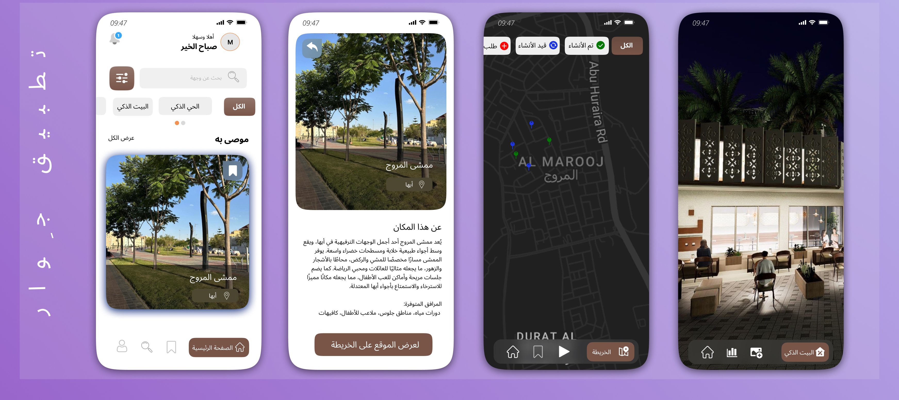

### الواجهات التفاعلية

تتضمن الواجهات التفاعلية في مشروع **جوار** تصميم شاشات تفاعلية وأنظمة عرض رقمية مدمجة داخل الحي، تسمح للسكان والزوار بالتفاعل مع البيئة المحيطة بسهولة ويسر. توفر هذه الواجهات:

- معلومات حية عن الخدمات المحلية والفعاليات  
- خرائط ذكية تساعد في التنقل داخل الحي  
- إمكانية التواصل مع الجهات المعنية لتحسين الخدمات  
- دعم اللغة المحلية والتصميم الذي يعكس الهوية العسيرية  

تم تصميم الواجهات باستخدام أدوات متقدمة مثل **Figma**، لضمان تجربة مستخدم سلسة وجذابة تناسب مختلف الفئات العمرية.

